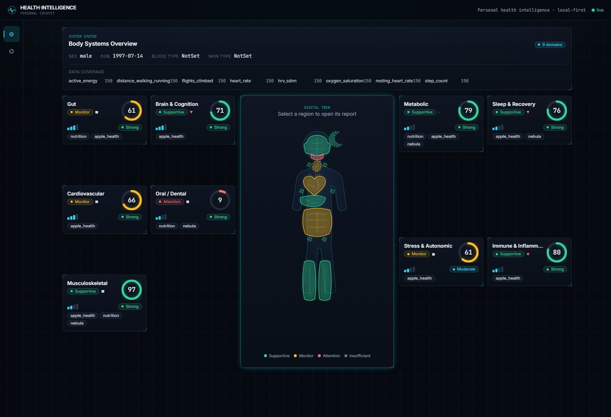
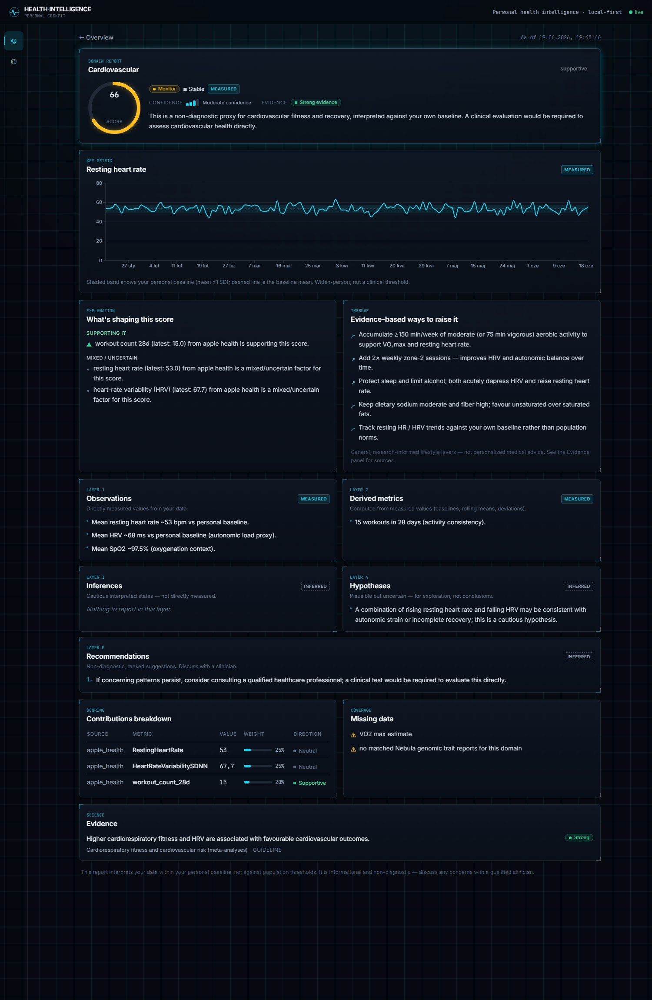
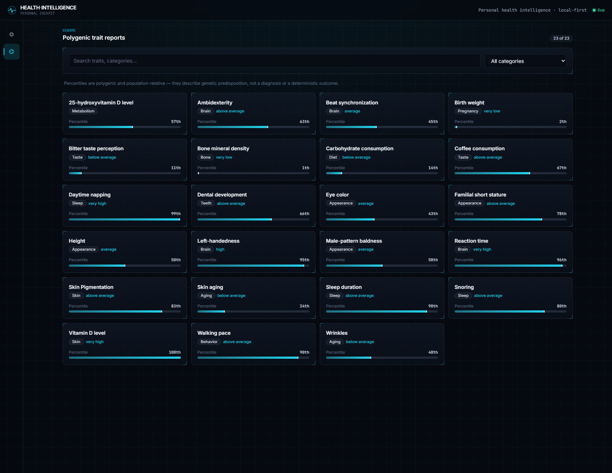
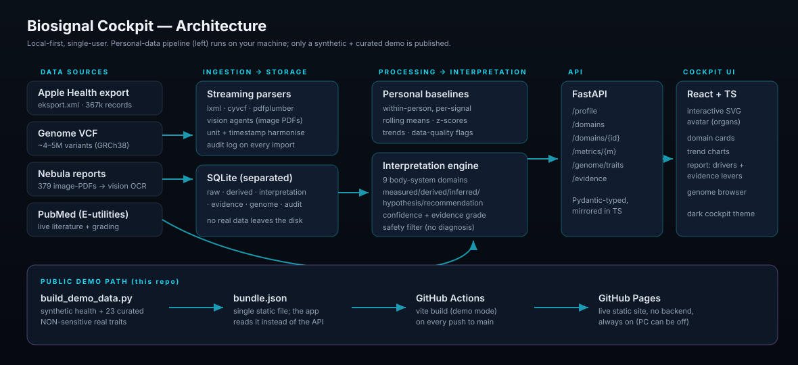

# 🧬 Biosignal Cockpit

**A personal experiment in turning my own quantified-self data — Apple Watch, whole-genome sequencing, and nutrition logs — into one interpretable "cockpit" of body-system signals.**

> ### ▶ Live demo: **https://albertl97.github.io/biosignal-cockpit/**
> Runs entirely in your browser on **synthetic health data** + a small curated set of **non-sensitive** real genetic traits. No backend, no real personal health data.

> ⚠️ **This is not a medical device and not clinical advice.** It's a hobby/portfolio project exploring whether messy consumer-health and genomic exports can be fused into something useful and *honest about its own uncertainty*. Every number is a within-person, non-diagnostic estimate. For anything health-related, talk to a qualified professional.

---



## What it does

It ingests four very different personal data sources, normalises them, computes **personal baselines and trends**, and runs a transparent interpretation engine that summarises **nine body-system domains** — each with a score, a confidence level, an evidence grade, and a plain-language explanation of *what is raising or lowering it* and *what the research suggests could improve it*.

A central interactive **SVG avatar** maps each domain to its organ; clicking opens a full report.

| | |
|---|---|
|  |  |
| **Domain report** — score, trend chart vs personal baseline, the five reasoning layers (measured → inferred), drivers, evidence-based levers, and PubMed citations. | **Genome browser** — polygenic trait reports with your percentile and the underlying variants (demo shows non-sensitive traits only). |

## The nine domains

Gut · Brain & Cognition · Cardiovascular · Oral / Dental · Musculoskeletal · Metabolic · Sleep & Recovery · Stress & Autonomic · Immune & Inflammation.

Each report strictly separates five layers (so you always know what's a fact vs a guess):
**Observation** (measured) → **Derived metric** → **Inference** → **Hypothesis** → **Recommendation**.

## Architecture



```
data sources → ingestion → SQLite → processing → interpretation → API → React cockpit
(Apple Health,   (streaming  (raw +    (personal     (9 domains,           (avatar,
 VCF, Nebula,     parsers +   derived)  baselines,    confidence,           cards,
 PubMed)          vision OCR)           trends)       evidence, safety)     reports)
```

- **Backend** — Python / FastAPI / SQLite. Streaming parsers (a 173 MB Apple Health XML and a 1.1 GB genome VCF are parsed without loading them into memory). Raw, derived, interpretation, and evidence data live in separate tables. 80+ tests.
- **Interpretation** — rule-based + statistical, always **within-person** (your HRV vs *your* baseline, not a population threshold). A safety filter strips any diagnostic phrasing before it can reach the UI.
- **Evidence** — live PubMed (NCBI E-utilities) with a publication-type grading heuristic, plus curated guideline references as a fallback.
- **Frontend** — React + TypeScript + Vite + Tailwind, dark "biohacker cockpit" aesthetic, interactive SVG avatar, Recharts trend charts.

See [`docs/ARCHITECTURE.md`](docs/ARCHITECTURE.md) for the full contract.

## A note on how it was built

This was built as an **orchestrated multi-agent project** (Claude Code): specialist agents for backend, data science/statistics, research/evidence, design, and frontend worked against a shared contract, with a human in the loop for every architectural decision.

The trickiest data problem: the **379 Nebula Genomics reports are flat images** with no text layer — `pdfplumber` and PyMuPDF both extract nothing. They were transcribed by a fan-out of **vision agents** (reading pre-rendered JPEGs) into structured JSON: ~3,500 variants with genotype, gene, effect size, frequency and p-value.

## Run it locally (full app, your own data)

```bash
# backend
cd backend && pip install -r requirements.txt
python -m app.ingestion.run --reset            # parse Apple Health + Nebula + GPX
python -m scripts.load_nebula_json             # merge vision-extracted Nebula JSON
python -m app.ingestion.run --skip apple_health nebula gpx   # VCF genotypes
python -m uvicorn app.main:app --port 8000     # API at :8000 (docs at /docs)

# frontend (new terminal)
cd frontend && npm install && npm run dev       # cockpit at http://localhost:5173
```

Your data files stay **git-ignored** at all times (see [Privacy](#privacy)). Tests: `cd backend && python -m pytest`.

## Build the public demo

```bash
cd backend && python -m scripts.build_demo_data   # writes frontend/public/demo/bundle.json
cd ../frontend && npm run build:demo              # static site in dist/
```

The same React app builds in two modes: as a live API client, or — with `VITE_DEMO=1` — as a fully static site that reads one bundled JSON file. That's what GitHub Pages serves.

## Privacy

This repo is engineered so **no real personal health data is ever committed**:

- `.gitignore` blocks all raw exports, the genome VCF/CRAM, the Nebula PDFs, the SQLite DB, tokens, and `.env`.
- The only real data in the public demo is a hand-curated set of **23 non-sensitive** genetic traits (eye colour, taste, vitamin D, sleep, etc.). All disease, psychiatric, cancer, and neurodegenerative reports are explicitly excluded; all biometric/nutrition data in the demo is **synthetic**.
- The full app is **local-first** — nothing leaves your machine.

## Future steps

This is a static snapshot today. The direction I'd like to take it:

- **Live Apple Watch streaming** — replace the one-off export with a continuous HealthKit feed so biometrics update in (near) real time.
- **Live nutrition feed** — connect a nutrition app so meals update the metabolic/gut signals as they're logged.
- **Real-time re-scoring** — recompute domain scores, drivers, and suggestions on the incoming data stream instead of on demand.
- **Richer genomics** — polygenic-score recalculation and pharmacogenomics, with the same caution-first framing.
- **Anomaly detection & "what-if" simulation** — flag deviations from baseline and model the likely effect of a lifestyle change before trying it.

## Tech stack

Python · FastAPI · SQLite · pandas/numpy/scipy · lxml · pdfplumber · Biopython (PubMed) · React · TypeScript · Vite · Tailwind · Recharts · framer-motion · GitHub Actions + Pages.

## License

[MIT](LICENSE) — code only. Not for clinical use.
